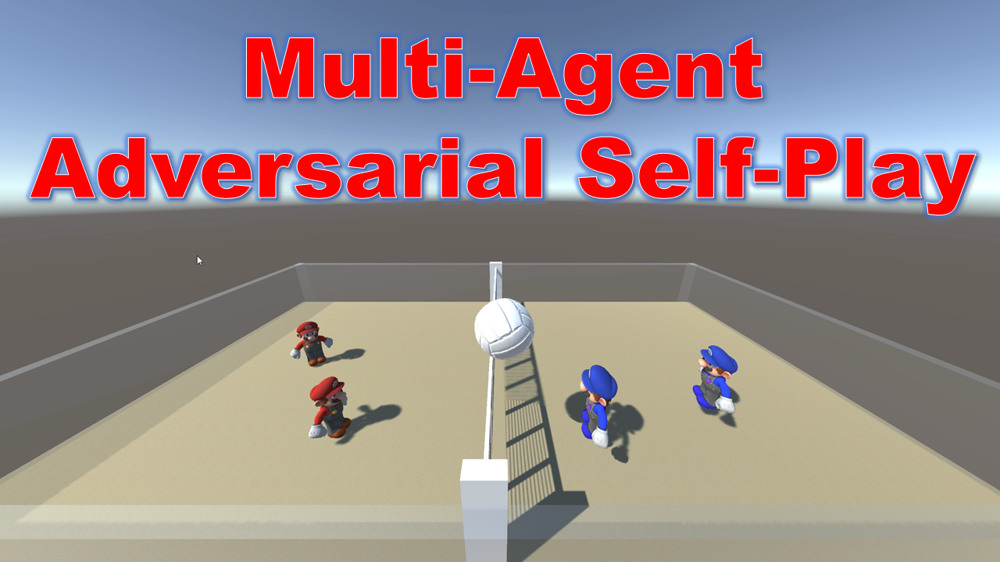

# Multi-Agent Adversarial Self-Play
This is a AI based multi-agent Volley Ball Game using Deep Reinforcement Learning.

This project Depends on the following:

* Unity
* ML-Agents v2.0
* Tensorflow 2.6

